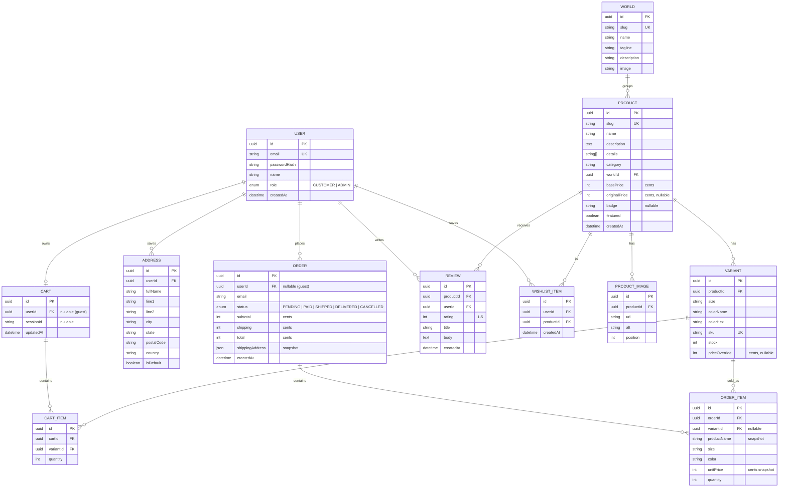

# VAMPGEN — Backend Architecture

A proposal for turning VAMPGEN from a mock-data storefront into a full-stack application, designed to showcase real backend engineering: typed REST API, relational data modelling, authentication, and clean separation of concerns.

---

## 🎯 Recommended Stack

| Layer | Choice | Why |
|---|---|---|
| **Runtime** | Node.js 20 + **TypeScript** | End-to-end TypeScript with the React frontend — shared types, one language |
| **Framework** | **Express** (or Fastify) | The most recognised Node API framework; clean, well-understood, hugely employable |
| **Database** | **PostgreSQL** | Industry-standard relational DB; the right fit for an inventory/orders domain |
| **ORM** | **Prisma** | Type-safe queries, painless migrations, great DX — pairs perfectly with TS |
| **Auth** | **JWT** in httpOnly cookies + **bcrypt/argon2** | Stateless, secure, simple to demonstrate |
| **Validation** | **Zod** | Already used on the frontend — share schemas across the stack |
| **Data fetching (FE)** | **TanStack Query** | Caching, loading/error states, mutations — replaces the static catalog |
| **Hosting** | API → **Render/Railway**, DB → **Neon**, Web → **Vercel** | Generous free tiers, zero-config Postgres |

> **Money is stored as integer cents** everywhere (never floats) — a small detail that signals real-world care.

### Why this stack
- **Resume-legible.** Node + Express + PostgreSQL + Prisma + JWT is the single most recognisable, in-demand backend combination — every line reads as a hireable keyword.
- **Type-safe, end to end.** Prisma generates types from the schema; Zod validates at the edges; the frontend already speaks TypeScript. Few seams for bugs to hide.
- **Right-sized.** A relational store (products → variants → orders) is a textbook PostgreSQL domain. No premature microservices, no NoSQL mismatch.

### Alternatives considered
| Option | Verdict |
|---|---|
| **NestJS** + Prisma | Great "senior architecture" signal (modules, DI, guards). Pick this if you want to show enterprise structure — more boilerplate. |
| **Supabase** (managed PG + auth) | Fastest to ship, but reads as "used a BaaS" rather than "built a backend." Less to showcase. |
| **tRPC** + Prisma | Beautiful end-to-end type safety, but couples client/server. Best in a monorepo; less legible to recruiters than REST. |

---

## 🗃️ Data Model



### Modelling notes
- **`VARIANT` is the buyable unit** — a specific size + colour with its own SKU and `stock`. Carts and orders reference variants, not products, so inventory is tracked accurately.
- **Orders snapshot their data** (`productName`, `unitPrice`, `size`, `color`) so historical orders stay correct even if a product is later renamed, re-priced, or deleted.
- **Guest carts** use `sessionId`; on login they merge into the user's cart.
- **`REVIEW` / `WISHLIST_ITEM`** are modelled now but can ship in a later phase.

---

## 🔌 API Surface (REST)

```
Auth
  POST   /api/auth/register
  POST   /api/auth/login
  POST   /api/auth/logout
  GET    /api/auth/me

Catalog
  GET    /api/products            ?category=&world=&sort=&search=&page=
  GET    /api/products/:slug
  GET    /api/collections
  GET    /api/collections/:slug

Cart
  GET    /api/cart
  POST   /api/cart/items          { variantId, quantity }
  PATCH  /api/cart/items/:id      { quantity }
  DELETE /api/cart/items/:id

Orders
  POST   /api/orders              (checkout: address + cart -> order)
  GET    /api/orders              (current user's orders)
  GET    /api/orders/:id

Wishlist            (phase 2)
  GET/POST/DELETE   /api/wishlist

Admin               (optional)
  POST/PATCH/DELETE /api/admin/products, /api/admin/orders
```

**Cross-cutting:** Zod request validation, centralised error handler, rate limiting on auth, CORS locked to the web origin, request logging (pino).

---

## 🔗 Frontend Integration

The current static catalog becomes an API-backed one with minimal churn:

1. Add `src/lib/api.ts` — a typed fetch client (cookies included).
2. Wrap the app in **TanStack Query**; replace direct `products.ts` reads in `ShopPage`, `WorldPage`, `ProductDetailPage` with `useQuery` hooks.
3. `CartContext` syncs to `/api/cart` when authenticated, falling back to `localStorage` for guests (merge on login).
4. Add `/login`, `/account` (orders + addresses), and wire checkout to `POST /api/orders`.
5. Keep `products.ts` as the **seed source** for the database.

---

## 🧩 Repository Shape (monorepo)

```
VampGen/
├── client/            # existing Vite + React app
└── server/            # new API
    ├── prisma/
    │   ├── schema.prisma
    │   └── seed.ts     # seeds from the existing catalog
    └── src/
        ├── modules/    # auth, products, cart, orders
        ├── middleware/ # validate, auth, error
        ├── lib/        # prisma client, jwt, hashing
        └── index.ts
```

## 🚀 Suggested build phases

| Phase | Deliverable |
|---|---|
| **B1** | Scaffold server (TS + Express + Prisma), Postgres connection, `/health` |
| **B2** | Schema + migrations + **seed from `products.ts`** |
| **B3** | Catalog endpoints → wire Shop / PDP / World to the API (TanStack Query) |
| **B4** | Auth (register / login / me) + `/account` |
| **B5** | Server cart + orders + checkout integration |
| **B6** | Deploy (Render API · Neon DB · Vercel web) + env wiring |

---

_See [`README.md`](../README.md) for the front-end overview._
